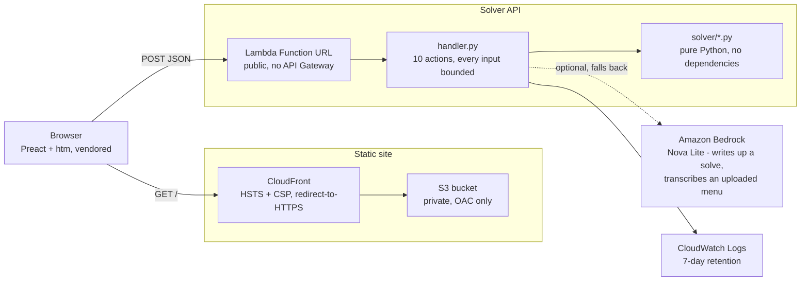
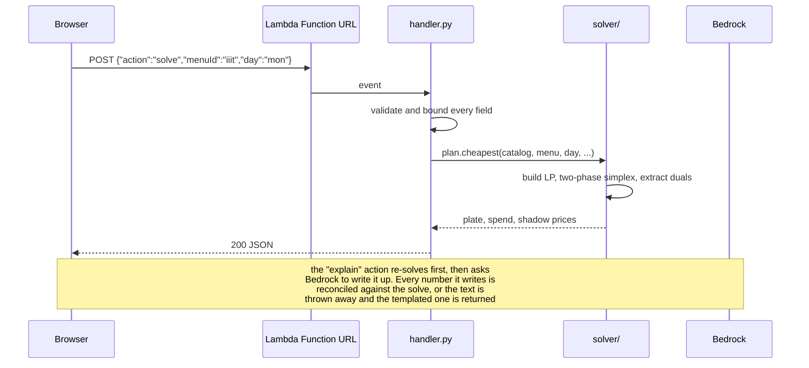

# PlateGap

**Your meal plan is already paid for. PlateGap works out what it still leaves
you short of, and the cheapest thing you can buy to fix it.**

[](https://d2u44arueak38s.cloudfront.net)
[](https://github.com/Sarcastic-Soul/PlateGap/actions/workflows/deploy.yml)
[](https://github.com/Sarcastic-Soul/PlateGap/actions/workflows/test.yml)
[](tests/)
[](pyproject.toml)
[](pyproject.toml)
[](web/)
[](infra/)
[](infra/)

> A hostel mess fee or a campus meal plan is a **sunk cost**. Once it is paid,
> the food on the counter is free at the margin — but it is rationed:
> unlimited rice and roti, one ladle of paneer, one boiled egg. Students top
> the rest up out of their own pockets without ever knowing what they are
> topping up, or whether they are buying the right thing.

| | |
| --- | --- |
| **Live site** | <https://d2u44arueak38s.cloudfront.net> — no sign-up, nothing to install |
| **Live API** | <https://j3h24i4cnnjhwwxyoenqibxene0yrrju.lambda-url.us-east-1.on.aws/> |
| **Solver** | two-phase simplex with dual extraction, written from scratch, no dependencies |

---

## Contents

- [The three questions](#the-three-questions)
- [Try it](#try-it)
- [14 real menus](#14-real-menus)
- [What's interesting about it](#whats-interesting-about-it)
- [Architecture](#architecture)
- [The API](#the-api)
- [Presets](#presets)
- [Where the numbers come from](#where-the-numbers-come-from)
- [Running it](#running-it)
- [Deploying](#deploying)
- [Infrastructure decisions, and what they cost](#infrastructure-decisions-and-what-they-cost)
- [What it doesn't know](#what-it-doesnt-know)
- [Licence and credits](#licence-and-credits)

---

## The three questions

Each one is a linear program.

| # | Question | What the LP does | The interesting output |
| --- | --- | --- | --- |
| 1 | **Where's the gap?** | Eat the menu as well as it can possibly be eaten, inside the portions actually served and inside what a person can get through in a day | What is still missing, and which ration cap is doing the damage |
| 2 | **What's the cheapest fix?** | Add priced items from a shop, minimise money spent, hit every nutrient floor | The shadow price on a binding floor is literally *what the last milligram of zinc costs you* |
| 3 | **What should the kitchen change?** | Given that students are spending their own money to patch the menu, which single addition would cut that spending the most — across everybody? | The one menu change with the highest return, and why |

Three presets ship, and you can use your own instead. **Photograph the menu on
your mess wall, or drop in the PDF the warden sent round**, and it is read,
matched to the catalog dish by dish, and shown to you to correct before
anything is solved. You can also paste it in as text, or build one by hand a
meal at a time — and share whatever you end up with as a link. The whole menu
travels in the URL fragment, so there is nothing stored anywhere and nothing
to sign into.

## Try it

```bash
curl -sS -X POST https://j3h24i4cnnjhwwxyoenqibxene0yrrju.lambda-url.us-east-1.on.aws/ \
  -H 'content-type: application/json' \
  -d '{"action": "solve", "menuId": "iiit", "day": "mon"}'
```

## 14 real menus

PlateGap was built against one mess menu. To check the problem is not just
that one, [`docs/hackathon/FIELD-STUDY.md`](docs/hackathon/FIELD-STUDY.md) runs
the app's own pipeline over 14 hostel menus published by 12 Indian
institutions: transcribed by the app's reader, matched by the live parser,
and every leftover name settled with a written reason. Then it solves a whole
week for each menu. For a vegetarian woman eating the best plate each menu
allows, 12 of the 14 menus fall short of the iron target on some day, and 6
fall short on every day. Closing all the gaps costs a median ₹267 a week.

The study also found five bugs in the menu reader, all now fixed and tested:
grids with the days down the side, paid extras counted as food, dated
fortnights, near matches like "curd rice" read as plain rice, and a sandwich
read as turkey. The regional names it kept meeting ship as
[`data/aliases.json`](data/aliases.json).

```
uv run python scripts/field_study.py parse && uv run python scripts/field_study.py run
```

## What's interesting about it

### The solver is written from scratch

- `solver/simplex.py` is a two-phase simplex with dual extraction, in pure
  Python, **no dependencies** — the Lambda runtime provides boto3 and the
  function needs nothing else.
- It is held to `scipy.optimize.linprog` on a few hundred random instances
  every time the code changes.
- The tests check the **duals**, not just the objective, because the duals are
  what the product actually shows.

**That test caught the bug that mattered.** Normalising a constraint with a
negative right-hand side negates the row, and negating a row negates its
marginal. With one uniform sign convention, 90 of 267 tests failed: objectives
were right and duals were sign-flipped — on exactly the nutrient-floor rows
this product exists to display. Tracking a per-row sign fixed it.

### Every shadow price says how far it holds

- A shadow price is a slope, true only until the plan turns a corner. The
  solver reads, off the same final tableau, the range each right-hand side can
  move through before its dual changes, and the range each price can move
  through before the plan does.
- The interface shows both: "zinc costs ₹7.53 a milligram — between 16.97 and
  17.14 mg", and, for each thing on the shopping list, how far its price can be
  wrong before the list changes.
- There is no reference implementation to compare ranges against, so
  `tests/test_ranging.py` re-solves instead: inside every range the prediction
  must hold exactly, and just past an edge it must fail wherever the dual is
  unique.
- Edges are rounded inward, because the ranges are guarantees. Rounding a
  threshold to a whole rupee once put out "not worth buying above ₹8" when the
  true threshold was ₹8.42.

### The menu audit is the simplex pricing step used as a feature

- Searching for the best dish to add by re-solving the week once per candidate
  is slow.
- At the optimum, a variable left out of the program improves the objective
  only if its **reduced cost** is negative, and pricing a candidate against the
  duals we already have costs one dot product.
- On Monday's menu that screens **56 candidates down to 8** before any extra
  solve runs.
- There is a test that takes every *rejected* candidate, adds it for real and
  re-solves, because a screen with a false negative would silently drop the
  best recommendation and still look like a working feature.

The same arithmetic explains itself: the reduced cost is a sum of one term per
constraint, so it decomposes into *why* — "add matar chola, mainly because it
is a cheap route to the zinc floor".

### The constraint that turned out to matter was a physical one

Without a cap on how much food a person can eat in a day, the solver meets
every ICMR target from the mess alone by prescribing twelve rotis and five
servings of curd. Arithmetically perfect, useless.

With the cap in place, the binding constraint on a well-stocked menu is
*stomach volume*, not the menu — and the shadow price on that row is the money
value of one more gram of appetite. It is the most interesting number the
program produces, and it only exists because the first answer was obviously
wrong.

## Architecture



| Module | What it does |
| --- | --- |
| `solver/simplex.py` | Two-phase simplex with dual extraction. Pure Python, no dependencies |
| `solver/model.py` | Turns a menu, a profile and a set of prices into linear programs |
| `solver/plan.py` | The three questions as callable functions: `gap`, `cheapest`, `frontier`, `week` |
| `solver/audit.py` | Inverse optimisation: reduced-cost menu search |
| `solver/menutext.py` | Reads a written menu — a paste or a grid — and matches it to the catalog. No model, no network |
| `solver/menuscan.py` | Turns an uploaded PDF or photograph into text, and hands it to `menutext` |
| `solver/explain.py` | Bedrock write-up, with a templated fallback and an arithmetic check |
| `solver/targets.py` | Daily nutrient targets by region, sex and activity level |
| `lambda/handler.py` | The one Lambda entry point, served through a Function URL |

### One request, end to end



### Why the front end has no build step

- **Preact with htm**, 13 KB of it, vendored as a single module in
  `web/vendor/` and loaded with a plain `<script type="module">`.
- No `node_modules`, no transpiler, no bundler: htm is JSX-shaped markup in
  template literals, which the browser parses as ordinary JavaScript, and the
  standalone build has no bare import specifiers, so no import map is needed.
- The migration from the hand-rolled DOM builder it replaced was checked by
  re-running `scripts/capture_demo.py` against both: all seven screenshots came
  out byte-identical.
- Because the site is a handful of static files with no build step, the
  **content security policy could be written by reading them** rather than by
  guessing:

```
default-src 'none'; script-src 'self'; style-src 'self'; img-src 'self' data:;
connect-src 'self' https://<function-id>.lambda-url.us-east-1.on.aws;
base-uri 'none'; form-action 'none'; frame-ancestors 'none'
```

Everything the page loads is same-origin. The two exceptions are the emoji
favicon, which is a `data:` SVG in the head, and the `fetch` to the Function
URL, which is a different origin and so has to be named — Terraform takes it
from the resource rather than a pasted string, so a rebuild in another account
gets a policy that works instead of one that silently blocks every request.
There is no `'unsafe-inline'` and no `'unsafe-eval'` anywhere: the chart is an
inline `<svg>` styled with classes, nothing assigns to `element.style`, and
the one dependency is vendored rather than pulled from a CDN, so
`script-src 'self'` covers the framework too.

## The API

One Lambda Function URL. POST a JSON body with an `action`; you get a JSON
body back. No API Gateway, no routing, no authorizers, no usage plans, no
keys, no sign-up.

Every solving action — `gap`, `solve`, `frontier`, `week`, `audit`, `explain`
— takes `menuId` *or* an inline `menu`, plus the optional `profile`, `diet`
(`all`, `egg`, `veg`, `vegan`), `prices` and `excluded`.

| `action` | What it answers | Additional body fields |
| --- | --- | --- |
| `presets` | The shipped menus, diets, regions, nutrients and catalog notes | — (this is the default when `action` is missing) |
| `catalog` | Every dish and market item, for building your own menu | — |
| `gap` | What one day of the menu leaves you short of | `day` |
| `solve` | The cheapest shopping list that closes that gap | `day`, `budget` |
| `frontier` | Every point between spending nothing and spending enough | `day`, `points` (2–60, default 24) |
| `week` | All seven days solved | — |
| `audit` | Which single menu addition would cut student spending the most | `students` (1–1,000,000) |
| `parse` | A pasted menu, matched dish by dish against the catalog | `text`, `name`, `region` |
| `scan` | An uploaded PDF or photograph of a menu, transcribed and then parsed | `file` (base64), `kind`, `name`, `region` |
| `explain` | A day's solve written up in prose, with its arithmetic checked | `day`, `model` |

Notes worth knowing:

- **`parse` never calls a model.** Matching written names against a fixed
  catalog is a string problem with a right answer. Its most important field is
  `unmatched`: everything it could not place comes back with the near misses
  that were rejected, because quietly dropping half of somebody's menu and then
  reporting a shortfall they do not have would be the worst failure mode this
  product has.
- **`scan` is capped at 500 reads a day**, counted in DynamoDB and reset at
  midnight UTC. Past the cap it returns 200 with `read: false` and a sentence
  pointing at `parse`, which runs on the standard library and has no limit.
  `PLATEGAP_SCAN_MODEL=off` disables it outright.
- **`scan` lets a model type, and not decide.** The model transcribes the
  file into text and stops there. Which catalog dish each written name means
  is settled by `menutext`, offline and deterministically, so a name it cannot
  place is reported rather than invented. The transcription comes back
  alongside the parse so it can be corrected and sent through `parse` again.
  Like `explain`, it returns 200 with `read: false` when Bedrock is missing,
  denied or slow — the paste box does the same job without it.
- **`explain` always returns 200.** It re-solves rather than trusting numbers
  the caller sent, and every figure in the generated text is extracted and
  matched back against the solve. If Bedrock is missing, denied, slow, or
  writes a number that does not reconcile, the templated explanation is
  returned with `source` saying so.
- Nothing the caller typed reaches the model on the `explain` path. A menu you
  posted is referred to as "your menu", never by the name you gave it. On the
  `scan` path the caller's file is the input by definition — so nothing the
  model writes back is treated as an instruction either. Its output is split
  on pipes and commas and compared against a fixed catalog, and that is all
  that ever happens to it.
- The endpoint is public and unauthenticated, so every input is bounded: body
  size, price entries, pasted length, frontier points, student count.

## Presets

| Preset | `menuId` | What it is | Targets | Provenance |
| --- | --- | --- | --- | --- |
| **IIIT hostel mess** | `iiit` | A real seven-day Indian hostel mess timetable | ICMR-NIN 2020, INR | Transcribed from the posted weekly timetable, `data/menus/iiit-mess-menu.pdf` |
| **University dining hall** | `dining-hall` | A representative North American all-you-care-to-eat plan | US DRI, USD | Composite. Not a transcription of one real hall — a rotation assembled from patterns common to North American residential meal plans |
| **Generic cafeteria** | `generic` | A deliberately plain menu to start from and edit | ICMR-NIN 2020, INR | Invented. Nothing in it is a claim about any real canteen |

Serving style is part of the menu, not an assumption baked into the solver:
staples like rice, roti and dal are self-serve and effectively unlimited;
paneer, chicken, egg and sweets are rationed to one portion.

## Where the numbers come from

109 dishes, 28 market items and 76 ingredients, across 16 nutrients. **A
dish's nutrition is never estimated at dish level** — it is the sum of its
ingredients in stated grams, each scaled by how much of that nutrient survives
the way the dish cooks it. So any single assumption can be argued with
directly rather than having to take the whole table on faith.

| Source | Used for | Notes |
| --- | --- | --- |
| **USDA FoodData Central, SR Legacy** | Nearly every ingredient, cited by `fdcId`, per 100 g | The measured backbone of the catalog |
| **USDA Table of Nutrient Retention Factors, Release 6 (2007)** | How much of each nutrient survives cooking | Every recipe line says how the ingredient is prepared |
| **Indian Food Composition Tables 2017 (NIN-ICMR)** | Paneer and jaggery | A measured Indian table rather than a guess at an Indian food — but still flagged *estimated* (see below) |
| **ICMR-NIN 2020** and the **US DRI** | Daily targets, by region | Both ship, because they disagree sharply |
| **Seed market prices** | Default prices for shop items | **Not survey data.** Every one is editable in the interface, because a price that is wrong for your campus makes the recommendation wrong for you |

**Cooking is charged for.** Boiled into a gravy, a vegetable keeps 85% of its
vitamin C and all of its minerals; boiled and drained, it keeps 75% of the
vitamin C and 90% of the potassium. The trap is double-counting: SR Legacy
carries both raw and cooked rows, this catalog cites the cooked one wherever it
exists, and taking the loss off *again* would manufacture a shortfall — in the
direction that flatters a product built to sell shortfalls. So those rows take
a factor of **1.0** and a test enforces it.

**Paneer and jaggery have no SR Legacy equivalent.** Using a bad USDA
substitute would have been worse than admitting the gap: whole-milk ricotta,
the nearest fresh acid-set cheese, reports 7.5 g protein per 100 g against
paneer's 18.9 g. Both now come from IFCT 2017, which puts paneer's calcium at
476 mg per 100 g against the 208 mg previously guessed. Both stay flagged as
*estimated* anyway, for one honest reason: **IFCT 2017 measures vitamin
B12 for only a handful of fish and meats, and not for paneer or jaggery**, so fifteen of the sixteen nutrients are
sourced and the sixteenth is not. The catalog names which.

**Two reference systems ship, because they disagree.** Iron for an adult man is
19 mg under ICMR-NIN and 8 mg under the US DRI, since the Indian figure assumes
a largely plant-based diet and poorer absorption. Presenting either as
universal would be wrong for half the people who open the app.

Every serving weight, recipe and retention factor is printed in
**[docs/DATA.md](docs/DATA.md)**, which is generated from the catalog rather
than written, so it cannot quietly drift away from what the solver actually
uses.

## Running it

```bash
uv run --group dev pytest -q                  # 873 tests
uv run python scripts/dev_server.py           # http://127.0.0.1:8000
uv run python scripts/benchmark_solver.py     # times the four solver actions
SITE=http://127.0.0.1:8000 uv run --group dev python scripts/smoke_ui.py
```

Rebuilding the food catalog needs the SR Legacy CSV download, and the data
document is regenerated from the rebuilt catalog:

```bash
uv run python data/build_catalog.py --sr path/to/FoodData_Central_sr_legacy_food_csv_2018-04
uv run python scripts/gen_data_doc.py         # rewrites docs/DATA.md
```

## Deploying

```bash
cd infra
terraform init
terraform apply
```

Then set the outputs as **repository variables** — not secrets, because they
are identifiers rather than credentials:

| Variable | From the Terraform output |
| --- | --- |
| `AWS_DEPLOY_ROLE` | `github_deploy_role_arn` |
| `AWS_REGION` | `region` |
| `SITE_BUCKET` | `site_bucket` |
| `LAMBDA_FUNCTION` | `lambda_function_name` |
| `DISTRIBUTION_ID` | `distribution_id` |

Pushes to `main` then run the tests, build the package, update the function,
publish the site, invalidate the cache and **call the live endpoint before the
workflow finishes** — a green deploy that produced a broken endpoint is worse
than a red one.

**There are no access keys in this repository or its settings.** GitHub Actions
assumes an AWS role through OIDC, and the trust policy is pinned to this
repository and the `main` branch, so a pull request from a fork gets a token
with a different subject and cannot assume it. The role can update function
code, write the site and invalidate the cache; it cannot create or destroy
infrastructure. Terraform is run by a person, deliberately.

## Infrastructure decisions, and what they cost

| Decision | Why | What is *not* claimed |
| --- | --- | --- |
| **No API Gateway** | The function takes a JSON body and returns one. Routing, authorizers and usage plans would be a second service to configure and a second place for CORS to go wrong, in exchange for nothing this project uses | — |
| **One DynamoDB row, and only one** | The catalog ships inside the deployment package, which is 88 KB, and the menu you build travels in the URL fragment — so nothing that is *data* needs a database. The single thing that genuinely cannot be recomputed is how much has been spent today, and that is what the table holds: one row per day, `ADD` to increment, TTL to sweep up. On-demand, about **two cents a month** at the cap | A counter held in a module global would have been free, and wrong: it is per warm container, so the real ceiling becomes that number times however many containers are alive, resetting whenever AWS recycles one — an approximation, where the thing being approximated is money |
| **Lambda memory 1769 MB** | The exact point at which Lambda hands out one whole vCPU; a single-threaded pure-Python solver cannot use a second one. Measured, not guessed: `scripts/benchmark_solver.py` puts the weekly audit at 698 ms on a whole core, 1384 ms at 58% of one and 3400 ms at 29%. `infra/variables.tf` has the full argument | — |
| **arm64** | Kept for Graviton's published price — about 20% less per GB-second. That is a price list, not a benchmark | **This repository does not claim arm64 is faster, because nobody has measured it.** The solver is pure Python and its inner loop is list and float arithmetic in the interpreter; which way that goes on Graviton is not something to assert from an armchair. Running `scripts/benchmark_solver.py` on an arm64 box with the same `--repeat` and comparing medians would settle it in a couple of minutes |
| **Concurrency capped at 10** | Opening the page costs four calls, so three or four people following a shared link in the same second is the whole ceiling. Ten browsers arriving simultaneously threw away 4 of 40 calls with a 429 and the entire burst was over in **5.6 seconds**; the same ten spread over a minute lost nothing. A burst that short does not want a larger quota, so the front end retries with **jitter** — every client refused was refused at the same instant, and retrying them on the same schedule would rebuild the burst. `scripts/smoke_ui.py` tests both paths | — |
| **Bedrock on Nova Lite** | One `explain` call measured at 732 tokens in and ~130 out, about **$0.075 per thousand calls**. Nova Lite and Nova Micro both produced correct, readable paragraphs that passed the reconciliation check, so there was nothing to buy by spending more | Claude Haiku 4.5 is allowed by the IAM policy and the handler's allow-list, but this account answers it with `ResourceNotFoundException` until a use-case form is submitted. Nothing breaks: `explain` falls back to the templated text and still returns 200 |
| **`scan` on the same model** | Reading the real seven-day mess menu in `data/menus/` measured at 1,862 tokens in and ~1,100 out, about **$0.38 per thousand uploads**, in roughly ten seconds. A PDF goes to Bedrock as a `document` block with no rasterising step, so the function needs no image tooling | Transcription is not perfect and is not presented as though it were. A scan of it places 131 names across all seven days and reports 26 it could not place, each with the near misses it rejected. The text is shown and editable before anything is solved |
| **A daily cap on `scan`, in DynamoDB** | `scan` is the only action that spends money per call, on an endpoint that is public and unauthenticated on purpose. The account's concurrency limit of 10 bounds the *rate* to about one scan a second, which is **~$34/day** — more than this project's entire budget. So the spend itself is counted, and the 501st scan of a day is refused with `read: false`. 500/day is about **$0.20/day** | A per-caller rate limit would mean WAF, whose monthly minimum is several times the loss it prevents. There is no caller to count anyway: a Function URL has no API keys. The counter fails **closed** — if the tally cannot be read, the scan is refused, because anything that breaks the counter would otherwise remove the ceiling |
| **Public Function URL** | A tool anyone should be able to try without signing up | Accounts created from around 2024 onward block public Lambda function URLs by default, and the symptom is a bare 403 with a resource policy that plainly allows the call. Granting `lambda:InvokeFunction` to `*` alongside the `InvokeFunctionUrl` grant is what opens it. That grant **cannot be narrowed** — AWS rejects the `FunctionUrlAuthType` condition on it — so any AWS principal can invoke the function directly. `infra/lambda.tf` says so and explains why that is acceptable here |
| **Local Terraform state** | For one person applying from one machine: one fewer bucket, one fewer table, and no chicken-and-egg problem about which Terraform builds the backend the state lives in. The file is gitignored | **It cannot survive a second person.** Two states that each believe they are the truth produce orphaned resources Terraform will cheerfully create again. `infra/backend.tf.example` has the S3 + DynamoDB configuration and the `terraform init -migrate-state` sequence written out, to adopt the day a second person shows up |
| **The function's only permission** | Writing its own logs, plus `bedrock:InvokeModel` on two named models | Not `bedrock:*` on `*`: "two small models by name" is a bill somebody can read |

Full cost working is in
**[docs/hackathon/COST-AND-INFRA.md](docs/hackathon/COST-AND-INFRA.md)**. In
short: Lambda's million free requests a month and CloudFront's free tier are
always-free, and the rest is fractions of a cent.

## What it doesn't know

| Unknown | Why it is unknown |
| --- | --- |
| Whether the kitchen cooked the recipe we assumed | The recipes are stated assumptions, printed in [docs/DATA.md](docs/DATA.md) |
| What you like eating | The plan is nutritionally cheapest, not nicest |
| What a serving actually weighs | Every one is an estimate — a counted piece, a ladle, a plated portion. None are weighed, and [docs/DATA.md](docs/DATA.md) says which kind each is |
| Losses in serving and reheating | Cook loss is accounted for; a dish sitting in a warmer for an hour is not |
| Vitamin B12 for paneer and jaggery | IFCT 2017 measures B12 for only a few fish and meats, not these two, so it needs another source |
| Whether deep-fried flour and sprouts use the right retention codes | Deep-fried flour uses the sautéed-flour code, which probably understates the loss; sprouts use the shortest legume boiling code, which is longer than sprouts need and so probably overstates it. Release 6 has no pressure-cooking code at all |
| Whether the seed market prices match a real shop near campus | They are defaults, not a survey. Edit them |
| Whether arm64 is faster here | Nobody benchmarked it. See above |
| Anything marked *estimated* | It is flagged in the interface rather than presented as measured |

Open problems, and the measurements that settled the closed ones, are in
**[TODO.md](TODO.md)**.

## Licence and credits

The code and the writing are MIT licensed; see [LICENSE](LICENSE). The data
belongs to the people who measured it, and their terms apply:

- **USDA FoodData Central SR Legacy** and the **USDA Table of Nutrient
  Retention Factors, Release 6** are public domain. Nearly every number in
  `data/foods.json` comes from them.
- **Indian Food Composition Tables 2017** — Longvah T, Ananthan R,
  Bhaskarachary K, Venkaiah K; National Institute of Nutrition (ICMR),
  Hyderabad. Paneer (IFCT L003) and jaggery (IFCT I001) are taken from it,
  with thanks. NIN asks for written permission before its data is reproduced
  electronically in a product, so anyone reusing those two rows should ask NIN
  for themselves.
- **ICMR-NIN Nutrient Requirements for Indians (2020)** sets the Indian daily
  targets, and the **ICMR-NIN Dietary Guidelines for Indians (2024)** sets the
  standard katori sizes the serving weights are based on.
- The **14 hostel menus** in `data/field/menus/` are the colleges' own
  published menus. Each source is listed in
  [SOURCES.csv](data/field/menus/SOURCES.csv).
